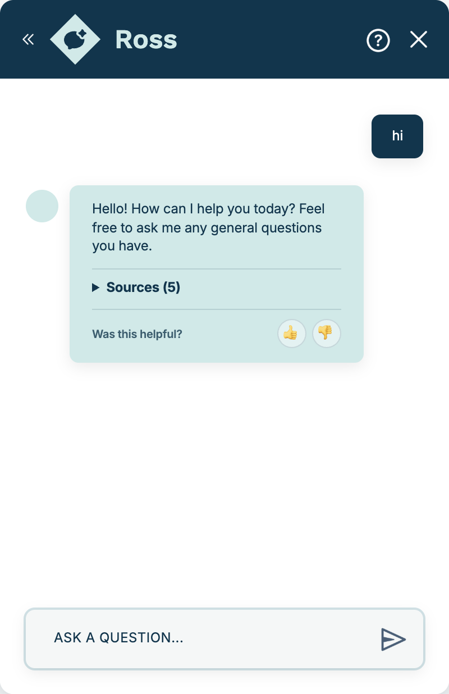

# Ross chatbot frontend

This repository contains the frontend and handoff materials for **Ross**, the
AI chatbot project for Lehigh University's P.C. Rossin College of Engineering
and Applied Science. The project was previously called **LE-Chat**; its current
name is **Ross**. The project sponsor is **Chris Larkin**.

Christopher and the school platform manage a fixed chatbot backend, retrieval
system, model, API, and production environment. This repository does not change
those systems. The student team provides the frontend design and the Ross
handoff inputs.

## For Christopher

Start with **[christopher-handoff/README.md](christopher-handoff/README.md)**.
It is the single delivery entry point for the frontend, five crawl URLs, Ross
system prompt, fixed API contract, AWS handoff boundary, and acceptance steps.

The delivery branch is `christopher-handoff`. The frontend must adapt to the
existing service; no backend or server change is requested by this repo.

## Local UI quick start

To run the frontend locally, use Node 22:

```bash
cd ai-chatbot-lehigh
npm ci
cp .env.example .env
npm run dev
```

Open <http://localhost:6173> and click the Ross button in the bottom-right
corner.

With the empty `.env` from the example, the dev server answers with built-in
demo replies and sends no requests. This checks the UI only. To reach the fixed
Ross service, set
`VITE_CHAT_API_URL` and `VITE_CHAT_BOT_NAME` in `.env` and restart
`npm run dev`. Christopher supplies the existing assigned values.

Before opening a pull request, run `npm run verify`. It runs the type check,
the contract tests, and a production build.



*Historical UI screenshot only: this local build was connected to an earlier
shared test service, not the Ross deployment. Do not copy its endpoint or bot
name.*

## Repository layout

| Path | Use |
| --- | --- |
| `ai-chatbot-lehigh/` | Ross frontend, tests, Dockerfile, and deployment notes |
| `christopher-handoff/` | Source links, Ross prompt, API contract, and QA checklist |
| `fetched_site/` | Snapshot of an earlier shared chatbot site and test material |
| `scripts/` | Prompt and question-suite helpers |
| `knowledge_base/` | Legacy working area; do not ingest `sample.md` |

## Frontend setup

The frontend needs an API endpoint, the Ross bot slug, and a public path at
build time. See [ai-chatbot-lehigh/README.md](ai-chatbot-lehigh/README.md) for
the commands and API contract.

The endpoint recorded in `fetched_site/` came from an earlier test site. It is
not the Ross deployment endpoint. Christopher will provide the fixed endpoint
and bot name already assigned to Ross.
