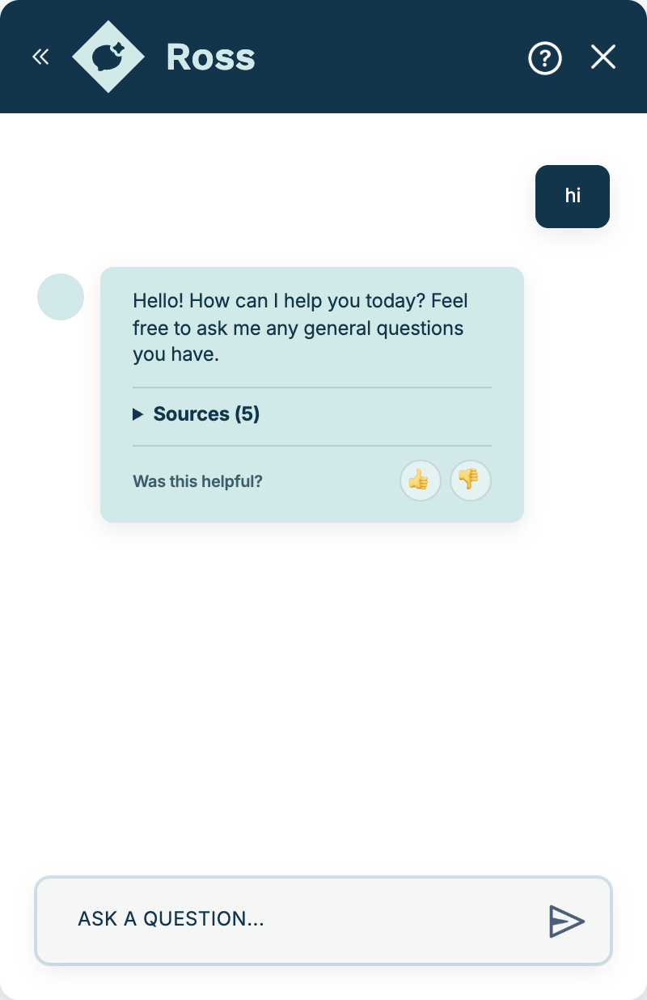

# Ross chatbot frontend

Ross is our chatbot project for Lehigh University's P.C. Rossin College of
Engineering and Applied Science, sponsored by Chris Larkin. It was previously
called LE-Chat. This repository contains the frontend and the materials we are
handing over to Christopher for deployment.

## For Christopher

The delivery branch is `christopher-handoff`. Start with the
[handoff README](christopher-handoff/README.md) for setup, or the
[October 1 update notes](christopher-handoff/UPDATES.md) if Ross is already
deployed. The handoff includes the system prompt, four source URLs, and a
checklist for testing the deployed chatbot.

## Local UI quick start

To run the frontend locally, use Node 22:

```bash
cd ai-chatbot-lehigh
npm ci
cp .env.example .env
npm run dev
```

Open <http://localhost:6173> and click the Ross button in the bottom-right
corner.

Leave the API settings blank to try the UI with built-in demo replies; no
requests are sent. To connect to Ross, set `VITE_CHAT_API_URL` and
`VITE_CHAT_BOT_NAME` in `.env` using the values Christopher confirms, then
restart the dev server.

Before opening a pull request, run `npm run verify` from `ai-chatbot-lehigh/`.
It checks types, runs the contract tests, builds the site, and checks the static
output.



*An earlier UI screenshot from a shared test service; it does not show the
current Ross deployment.*

## Repository layout

| Path | Use |
| --- | --- |
| `ai-chatbot-lehigh/` | Frontend, tests, Dockerfile, and build instructions |
| `christopher-handoff/` | System prompt, source URLs, API contract, and test checklist |
| `fetched_site/` | Earlier shared test-site snapshot and test material |
| `scripts/` | Prompt and question-suite helpers |
| `knowledge_base/` | Legacy working area; do not ingest `sample.md` |

## Deploying the frontend

The [frontend README](ai-chatbot-lehigh/README.md) covers build settings,
Apache, and Docker. The build produces static files in
`ai-chatbot-lehigh/build/client/`, which Apache can serve without a Node
process.

Use the API endpoint and bot name from the existing Ross deployment. The
settings saved in `fetched_site/` belong to an earlier test service, and the
displayed name "Ross" does not determine the API's bot name.
